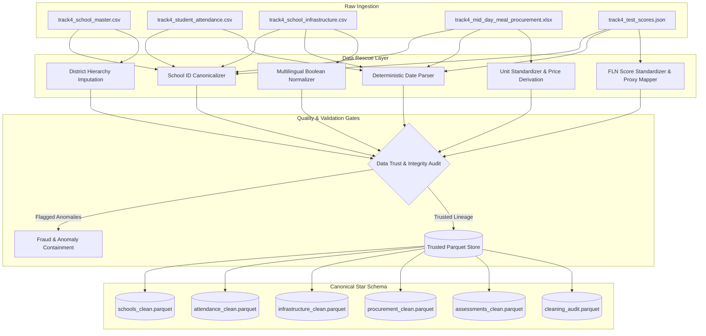

# EDUPULSE AI — Education Welfare Command Center
### Student Retention & Welfare Efficacy Tracker
**TransOrg AgentIQ Datathon — Track 4: Education & EdTech**  
*“Clean. Connect. Detect. Explain. Act.”*

---

## 1. Executive Summary & Problem Context
The State Education Department oversees student retention, learning outcomes, school infrastructure, and Mid-Day Meal (MDM) welfare operations across Punjab districts. However, operational datasets from disparate administrative sources are riddled with deliberate corruption:
- Disparate school identifiers (`SCH0050`, `sch_0050`, `SCH-0050`, `0050`, `S0050`)
- 6 distinct date formatting patterns spanning 365 calendar days
- Synthetic boolean variations (`Hai`, `Nahi`, `Functional`, `Kharab`, `1`, `0`, `na`)
- Impossible attendance records (`present_students > total_students`) and proxy attendance fraud (100% on Sundays)
- Mixed MDM measurement units (`kg`, `Grams`, `50kg Bags`, `Sacks`, embedded `"14.9 kg"`) and currency symbols
- 6 disparate academic grading scales (`Percentage`, `pct`, `%`, `CGPA`, `Raw Marks`, `Letter Grade`)
- Missing administrative district dimensions

**EDUPULSE AI** converts this messy operational data into trusted, decision-ready intelligence using a rigorous, non-destructive **Data Trust Layer**, transparent **Intervention Risk Proxy**, interactive **C-Suite Command Center**, and grounded **AI Analyst**.

---

## 2. Core Architecture & Data Trust Pipeline



---

## 3. Data Rescue & Transformation Rules

| Domain | Raw Challenge | Canonical Standard | Remediation & Lineage Policy |
| :--- | :--- | :--- | :--- |
| **School IDs** | `SCH-0596`, `sch_0054`, `0286`, `S0212` | `SCHxxxx` | 100% matched to 600 unique schools in master table with 0 orphaned foreign keys. |
| **Dates** | 6 distinct patterns across 365 days | `YYYY-MM-DD` (ISO) | Deterministic regex parser extracts calendar year, month, quarter, week, day, is_weekend, is_sunday. |
| **Booleans** | `Hai`, `Nahi`, `Working`, `Kharab`, `1`, `0` | `TRUE` / `FALSE` / `UNKNOWN` | Multi-token dictionary resolution. **UNKNOWN is never converted to FALSE.** |
| **Attendance** | 835 impossible records (`present > total`); 1,011 Sunday 100% proxy records | Preserved with Flags | Records retained in fact table with `is_impossible_attendance=True` and `is_proxy_attendance=True`; quarantined from trusted KPIs. |
| **MDM Units** | Sacks, Bags, Bori, Grams, embedded `"14.9 kg"` | `Kilograms (kg)` | Bags/Sacks/Bori converted ($\times 50$), Grams converted ($/ 1000$). Missing quantities derived via $Q = \text{Cost} / \text{Price}$. |
| **MDM Costs** | Currency symbols (`Rs.`, `₹`, `/-`, `,`) | Float INR | Stripped symbols; missing costs derived via $C = Q \times \text{Price}$. |
| **Test Scores** | 6 scales: `%`, `pct`, `Percentage`, `CGPA`, `Raw Marks`, `Letter Grade` | `0.0 - 100.0%` | CGPA scaled ($\times 10$); Raw Marks calculated ($\text{num}/\text{den} \times 100$); Letter grades mapped via documented mid-point proxy ($A+=95, A=85, B=75, C=65, D=50, E=35$). |
| **Districts** | 23 missing districts | Canonical District | 21 resolved deterministically from 1:1 administrative block hierarchy; 2 marked Unknown. |

---

## 4. Master Data Trust Score: **94.9 / 100**

The Data Trust Score is calculated transparently from measurable operational criteria:

$$\text{Trust Score} = (\text{Trusted Ratio} \times 40) + \text{Referential Score}(30) + \text{Rescue Score}(20) + \text{Anomaly Containment}(10)$$

- **Record Trustworthiness Points**: **37.0 / 40.0** (Based on 92.5% trusted record ratio across 44,594 operational rows)
- **Referential Integrity Points**: **30.0 / 30.0** (100% child-to-master key match with 0 orphaned entities)
- **Value Rescue Points**: **20.0 / 20.0** (Deterministic unit price and block-to-district imputation without synthetic hallucination)
- **Anomaly Containment Points**: **7.9 / 10.0** (Transparent quarantine of 835 impossible and 1,011 proxy attendance records)

---

## 5. Repository Structure

```
edupulse-ai/
├── README.md
├── requirements.txt
├── .gitignore
├── .env.example
├── Makefile
│
├── data/
│   ├── raw/                 # Untouched raw competition datasets
│   └── processed/           # Canonical analytical Parquet tables & audit logs
│
├── src/
│   ├── config.py            # Central constants, grain prices, and paths
│   ├── pipeline.py          # End-to-end reproducible data rescue pipeline
│   ├── ingestion/           # Safe raw loaders (CSV, Excel, JSON)
│   ├── cleaning/            # Pure transformation modules (IDs, dates, booleans, etc.)
│   ├── profiling/           # Data profiler & quality report generator
│   └── ...
│
├── tests/                   # 91 unit tests verifying transformations
└── docs/                    # Architecture, data dictionary, quality & validation reports
```

---

## 6. How to Run & Verify

### Install Dependencies
```bash
uv pip install -r requirements.txt
```

### Execute Data Audit (Phase 1)
```bash
python -m src.profiling.profiler
```

### Execute Master Cleaning Pipeline (Phase 2)
```bash
python -m src.pipeline
```
*Generates all clean Parquet datasets in `data/processed/` and decision audit logs in under 2 seconds.*

### Run Complete Test Suite
```bash
pytest tests/ -v
```
*All 91 test cases pass.*
