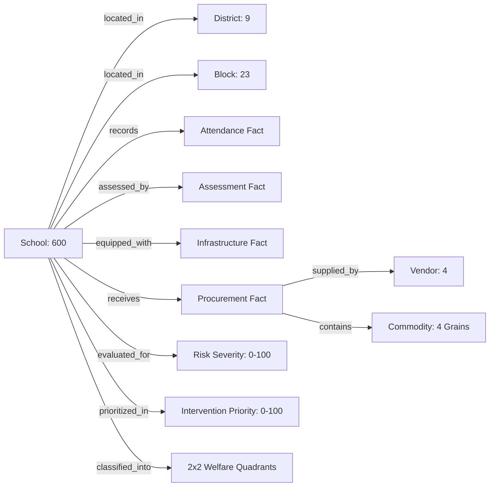

# AI Architecture — Graph-First Decision Intelligence Agent

**Platform:** EduPulse AI — Education Welfare Command Center  
**Component:** Autonomous Graph-First Decision Intelligence Agent (`src/agent/`)  
**Design Principle:** The LLM does NOT own the truth. Governed DuckDB owns the truth.  

---

## 1. Multi-Stage Governed Pipeline

```
User Query: "Which 10 schools should be reviewed first?"
   │
   ▼
[1. Security & Prompt Injection Guard] ──> Intercepts attacks, drops, XSS, malicious DDL/DML
   │
   ▼
[1.5 Fast-Path Greeting & Domain Guard] ──> "hi", "random data" handled in 0.06ms without DB
   │
   ▼
[2. Intent & Entity Resolution (Stage 1)]
   ├── Semantic Graph & Ontology (Schools, Districts, Amenities, Commodities)
   ├── Metric Registry Contract (Allowed filters, visualizations, caveats)
   └── Llama 3.1 Planner (Translates natural language to typed AgentIntent)
   │
   ▼
[3. Deterministic Query Planner] ──> Compiles parameterized, read-only DuckDB SQL query
   │
   ▼
[4. Governed SQL Guard] ──> Enforces SELECT/WITH only; disallows chaining & destructive keywords
   │
   ▼
[5. DuckDB Warehouse Execution] ──> Executes compiled query over canonical Parquet marts
   │
   ▼
[6. Verified Evidence Layer] ──> Packages raw result records, record counts, and provenance
   │
   ▼
[7. Grounded Answer Synthesis (Stage 2)]
   ├── Llama 3.1 Synthesizer (Narrative formulation strictly from verified evidence)
   └── Deterministic Fallback Engine (Zero-latency fallback on LLM rate-limit or failure)
   │
   ▼
[8. Post-Synthesis Claim Validation]
   ├── Verifies every numeric figure exists in executed DuckDB records
   ├── Audits school IDs and district names against evidence
   └── Rejects unsupported causal claims ("proves", "causes", "guarantees")
   │
   ▼
[9. Chart Intelligence Selector] ──> Automatically maps intent to optimal approved chart type
   │
   ▼
Structured AgentQueryResponse (Answer, Chart Plan, Citations, Methodology, Caveats)
```

---

## 2. The Semantic Graph Ontology

EduPulse AI implements an explicit domain ontology connecting educational entities, metrics, and governed views:



### Supported Entities & Semantic Relations:
- **`School`**: Canonical primary entity (`SCH0001`–`SCH0600`).
- **`District`**: 9 Punjab operational districts.
- **`Block`**: 23 administrative sub-districts.
- **`Amenity`**: 5 statutory amenities (`electricity`, `drinking_water`, `functional_toilet`, `boundary_wall`, `playground`).
- **`Commodity`**: 4 Mid-Day Meal staples (`Wheat`, `Rice`, `Pulses`, `Cooking Oil`).
- **`Risk Driver`**: Dominant constraint (`Attendance`, `Academic`, `Infrastructure`, `Multi-factor`).

---

## 3. Text-to-Chart Automatic Selection Policy

The system deterministically matches analytical intent and data shape to the optimal visualization type:

| Analytical Intent | Data Shape / Criteria | Selected Visualization | Example Prompt |
|---|---|---|---|
| **Ranking** | Ranked entities (schools, districts) | `horizontal_bar` | *"Which 10 schools should be reviewed first?"* |
| **Comparison** | Comparative metrics across districts | `bar` | *"Compare attendance and academic scores by district"* |
| **Statistical Association** | Bivariate correlation (X vs Y) | `scatter` | *"Are attendance and academic scores associated?"* |
| **Root-Cause Diagnosis** | Single institution deep dive | `kpi` / `table` | *"Why is SCH0386 in the intervention queue?"* |
| **Welfare Segmentation** | Infrastructure vs FLN matrix | `scatter` (quadrants) | *"Show me schools in the Critical Welfare quadrant"* |
| **Anomaly Audit** | Outlier records with threshold | `table` | *"Which procurement records are peer exceptions?"* |
| **Data Quality Audit** | Quality gate pass/fail summary | `table` / `kpi` | *"How trustworthy is the data?"* |
| **Conversational Greeting**| Casual input ("hi", "hello") | `none` | *"Hello"* |

---

## 4. Anti-Hallucination & Claim Verification

The claim validation engine (`src/agent/grounding/validator.py`) audits all synthesized text against the executed DuckDB evidence package before returning:
1. **Numeric Claims:** Every integer, percentage, and floating-point value is extracted and audited against the evidence record values. Unverified numbers trigger automatic repair synthesis or deterministic fallback substitution.
2. **Entity Consistency:** Mentioned school IDs (`SCH\d{4}`) and district names are checked against the query's returned dataset.
3. **Causal Language Filter:** Intercepts unsubstantiated causal claims (e.g. *"electricity causes higher scores"*, *"attendance proves academic improvement"*).
4. **Mandatory Caveats:** Every response includes explicit governance caveats and non-causal warnings.

---

## 5. Resilient Fallback & Circuit Breaker

To prevent runtime failure during third-party LLM rate-limiting (Groq 429) or provider disruption:
- **Instant Fallback:** On HTTP 429, 503, or timeout, the system switches immediately to `MockDeterministicProvider` without lag.
- **Circuit Breaker:** After 3 consecutive provider failures, all incoming requests route to the deterministic engine for a 60-second cooldown period.
- **Structured Safe Response:** The backend returns HTTP 200 with `status: "degraded"` and caveat `"AI reasoning temporarily unavailable; using governed analytical fallback."`—never an unhandled HTTP 500 error.
