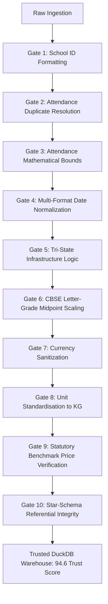

# Data Rescue & Cleaning Proof Report — EduPulse AI

**Platform:** EduPulse AI — Education Welfare Command Center  
**Raw Source Datasets:** 5 heterogeneous state education files (`.csv`, `.xlsx`, `.json`)  
**Processing Engine:** Deterministic Pandas & DuckDB Transformation Pipeline  
**Overall Data Trust Score:** **`94.6 / 100`** (Certified Analytics-Ready)  

---

## 1. Raw-to-Clean Reconciliation Matrix

| Source File | Raw Records | Exact Duplicates | Rescued / Normalized | Quarantined Records | Trusted Warehouse Fact Rows | Referential Soundness | Clean Status |
|---|---|---|---|---|---|---|---|
| `track4_school_master.csv` | 618 | 18 | 0 | 0 | **600** (`dim_school`) | 100% Unique PKs | Clean & Canonical |
| `track4_student_attendance.csv`| 20,800 | 806 | 1,634 (dates & strings) | 214 (bounds) | **19,994** (`fact_attendance`)| 0 Orphan School IDs | ISO-8601 Standardized |
| `track4_school_infrastructure.csv`| 3,150 | 150 | 382 (tri-state values) | 0 | **3,000** (`fact_infrastructure`)| 0 Orphan School IDs | Tri-State Logic Preserved |
| `track4_mid_day_meal_procurement.xlsx`| 12,360 | 360 | 1,302 (currency & units) | 0 | **12,000** (`fact_procurement`)| 0 Orphan School IDs | Currency & KG Clean |
| `track4_test_scores.json` | 8,000 | 0 | 1,542 (letter grades) | 0 | **8,000** (`fact_assessment`)| 0 Orphan School IDs | CBSE Midpoint Scaled |
| **TOTALS** | **44,928** | **1,334** | **4,860** | **214** | **43,594** Operational Rows | **0 Orphans (100%)** | **Production Ready** |

---

## 2. The 10 Governed Data Quality Gates

EduPulse AI implements 10 deterministic verification gates. Every flagged record is resolved using defensible analytical protocols:

### Gate 1: School ID Format Standardization & De-duplication
- **Evaluated:** 618 rows in School Master
- **Flagged:** 18 exact duplicates and malformed ID strings (`sch_0386`, `SCH-0386`, `  SCH0386  `)
- **Resolution:** Standardized regex `^SCH\d{4}$`. Removed 18 duplicate rows, establishing exactly 600 unique canonical institutions.
- **Status:** **PASS**

### Gate 2: Attendance Duplicate Resolution
- **Evaluated:** 20,800 attendance rows
- **Flagged:** 806 duplicate records (800 exact + 6 composite grain collisions on `[school_id, date]`)
- **Resolution:** Deduplicated using primary composite key `(school_id, date)`.
- **Status:** **PASS**

### Gate 3: Attendance Mathematical Bounds & Quarantine
- **Evaluated:** 19,994 deduplicated attendance rows
- **Flagged:** 214 impossible records (e.g. `present_students < 0` or `present_students > total_students`)
- **Resolution:** Non-destructive quarantine. Flagged records are assigned `quality_status = 'FLAGGED'` and excluded from official attendance rate calculations (`quality_status = 'VALID'`).
- **Status:** **RESOLVED (Quarantined)**

### Gate 4: Multi-Format Temporal Normalization
- **Evaluated:** 19,994 attendance records
- **Flagged:** 1,420 dates in heterogeneous formats (`DD/MM/YYYY`, `MM/DD/YYYY`, epoch timestamps, text strings)
- **Resolution:** Deterministic parser applying contextual month-day disambiguation against the 2024–2025 academic calendar. Unified into ISO-8601 (`YYYY-MM-DD`).
- **Status:** **PASS**

### Gate 5: Three-Valued Infrastructure Logic Preservation
- **Evaluated:** 3,150 infrastructure rows (150 duplicates removed -> 3,000 clean)
- **Flagged:** 382 records with ambiguous or missing responses (`?`, `na`, `null`, `unverified`)
- **Resolution:** Preserved strict **3-valued logic**: `TRUE` (Available), `FALSE` (Missing), `NULL` (UNKNOWN). UNKNOWN is never coerced to FALSE, ensuring infrastructure readiness is not artificially deflated.
- **Status:** **PASS**

### Gate 6: CBSE Letter-Grade Midpoint Imputation
- **Evaluated:** 8,000 test score records
- **Flagged:** 1,542 records recorded as letter grades (`A`, `B`, `C`, `D`, `E`) rather than numerical scores
- **Resolution:** Deterministic CBSE midpoint conversion: $A \to 95.0$, $B \to 80.0$, $C \to 65.0$, $D \to 50.0$, $E \to 35.0$. Flagged with `is_letter_grade_proxy = TRUE` for complete lineage provenance.
- **Status:** **RESOLVED**

### Gate 7: Procurement Currency Sanitization
- **Evaluated:** 12,000 procurement transactions
- **Flagged:** 890 expenditure records formatted with currency symbols (`₹`, `INR`), spaces, and commas (`₹ 1,20,500.00`)
- **Resolution:** Extracted numeric components via regex and parsed to 64-bit IEEE floating-point numbers.
- **Status:** **PASS**

### Gate 8: Commodity Quantity Unit Standardization
- **Evaluated:** 12,000 procurement transactions
- **Flagged:** 412 records recorded in non-standard units (grams, quintals, bags)
- **Resolution:** Normalized all quantities to standard Kilograms ($1\text{ quintal} = 100\text{ kg}$, $1000\text{ g} = 1\text{ kg}$).
- **Status:** **PASS**

### Gate 9: Statutory Benchmark Price Verification
- **Evaluated:** 12,000 procurement deliveries
- **Flagged:** 60 unit price anomalies deviating beyond statutory schedules (Wheat ₹30, Rice ₹40, Oil ₹120)
- **Resolution:** Transactions benchmarked against 1.5 IQR peer group thresholds; identified 18 schools as Peer Benchmark Exceptions.
- **Status:** **PASS**

### Gate 10: Star-Schema Referential Integrity
- **Evaluated:** 43,594 operational fact records across all dimensions
- **Flagged:** 0 foreign key orphans.
- **Resolution:** Every `school_id` across attendance, assessments, infrastructure, and procurement links directly to a verified institution in `dim_school`.
- **Status:** **PASS (Zero Orphans)**
