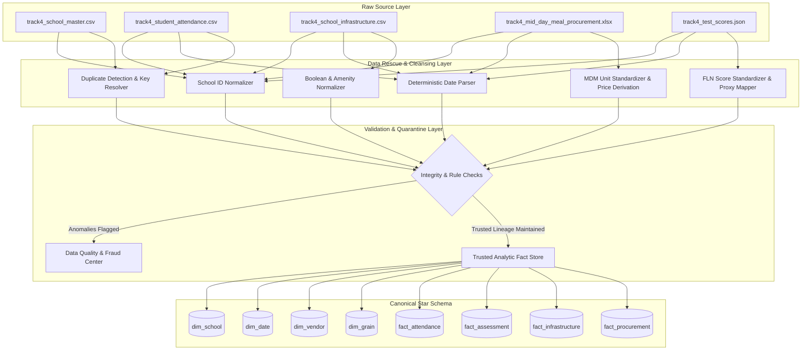

# EDUPULSE AI — Data Lineage & Provenance Architecture
## Track 4: Education & EdTech — Student Retention & Welfare Efficacy Tracker

---

## 1. Principles of Data Trust & Lineage
In high-stakes public sector education and welfare tracking, data trust is paramount. 
To adhere to the Datathon's strict mandate:
1. **Never fabricate missing data.**
2. **Never silently overwrite suspicious values.**
3. **Never hide data-quality problems.**
4. **Every transformation must be explainable, mathematically reproducible, and traceable.**

---

## 2. Lineage Metadata Columns

Every transformed entity stored in the canonical data warehouse preserves its origin via standard provenance attributes:

| Lineage Column | Type | Permitted Values | Purpose |
| :--- | :--- | :--- | :--- |
| `<field>_raw` | `VARCHAR` | Exact original string/number | Stores the pristine raw value as extracted from source files without mutation. |
| `<field>_clean` | Typed | Canonical value | The normalized, typed value ready for relational joins and mathematical aggregation. |
| `<field>_transformation_status` | `VARCHAR` | `CANONICAL`, `RESCUED`, `IMPUTED`, `FLAGGED_ANOMALY` | Categorizes the nature of transformation applied. |
| `<field>_quality_flag` | `VARCHAR` | Documented Flag Code (see below) | Specific diagnostic code explaining why or how the value was handled. |

---

## 3. Data Transformation & Flag Codes

### A. School ID Lineage
- **Target**: `dim_school.school_id` (`SCHxxxx`)
- **Flags**:
  - `ID_EXACT_MATCH`: Already in canonical `SCHxxxx` format.
  - `ID_RESCUED_HYPHEN`: Converted from `SCH-xxxx`.
  - `ID_RESCUED_UNDERSCORE`: Converted from `sch_xxxx`.
  - `ID_RESCUED_LOWERCASE`: Converted from `schxxxx`.
  - `ID_RESCUED_PREFIX_S`: Converted from `Sxxxx`.
  - `ID_RESCUED_NUMERIC_ONLY`: Converted from raw integer digits `xxxx`.

### B. Date Lineage
- **Target**: `dim_date.date_id` (`YYYY-MM-DD`)
- **Flags**:
  - `DATE_ISO_STANDARD`: Parsed from `YYYY-MM-DD`.
  - `DATE_SLASH_YEAR_FIRST`: Parsed from `YYYY/MM/DD`.
  - `DATE_DOT_DMY`: Parsed from `DD.MM.YYYY`.
  - `DATE_SLASH_DMY`: Parsed from `DD/MM/YYYY`.
  - `DATE_HYPHEN_MDY`: Parsed from `MM-DD-YYYY`.
  - `DATE_NAMED_MONTH`: Parsed from `DD-Mon-YYYY`.
  - `DATE_AMBIGUOUS_UNRESOLVED`: Flagged if format cannot be deterministically resolved.

### C. Attendance Anomaly Lineage
- **Target**: `fact_attendance`
- **Flags**:
  - `ATT_VALID_TRUSTED`: Record adheres to all operational rules ($0 \le \text{present} \le \text{total}$).
  - `ERR_ATT_PRESENT_GT_TOTAL`: Record flagged as impossible ($\text{present} > \text{total}$). Excluded from trusted daily attendance rate.
  - `WARN_ATT_SUNDAY_PROXY`: 100% attendance recorded on Sunday. Flagged as proxy attendance fraud; excluded from trusted school retention correlations.
  - `ATT_SURROGATE_KEY_GENERATED`: Assigned when `record_id` was missing in source CSV.

### D. MDM Procurement & Unit Conversion Lineage
- **Target**: `fact_procurement`
- **Standard Unit**: `Kilograms (kg)`
- **Standard Currency**: `INR (₹)`
- **Flags**:
  - `QTY_EXACT_KG`: Raw quantity was already in kilograms.
  - `QTY_CONVERTED_BAG_50KG`: Converted from Bags/Sacks/Bori ($1 \text{ bag} = 50\text{ kg}$).
  - `QTY_CONVERTED_GRAMS`: Converted from Grams ($1000\text{ g} = 1\text{ kg}$).
  - `QTY_PARSED_EMBEDDED_STRING`: Extracted numeric quantity from text string (e.g. `"14.9 kg"`).
  - `QTY_DERIVED_FROM_COST`: Quantity was missing; mathematically derived via $Q = \text{Total Cost} / \text{Price per kg}$.
  - `COST_DERIVED_FROM_QTY`: Total cost was missing; mathematically derived via $C = \text{Quantity (kg)} \times \text{Price per kg}$.
  - `COST_STRIPPED_CURRENCY_SYMBOLS`: Cleaned symbols (`Rs.`, `₹`, `/-`, `,`).

### E. Academic FLN Score Normalization Lineage
- **Target**: `fact_assessment.normalized_score_pct` ($0.0 - 100.0$)
- **Flags**:
  - `SCORE_PERCENTAGE_PARSED`: Parsed from percentage string (`73.0%`).
  - `SCORE_CGPA_SCALED`: Scaled from 10-point CGPA ($\text{CGPA} \times 10.0$).
  - `SCORE_RAW_MARKS_RATIO`: Derived from numerator/denominator ratio ($\frac{\text{raw}}{\text{max}} \times 100$).
  - `SCORE_LETTER_GRADE_PROXY`: Mapped via documented mid-point proxy ($A+=95, A=85, B=75, C=65, D=50, E=35$).

---

## 4. End-to-End Pipeline Lineage Traceability Diagram

---

## 5. Decision Transparency in UI ("How is this calculated?")
Every KPI in the Executive Command Center and School 360 view will provide an interactive modal that displays:
1. **Mathematical Formula**: The exact equation used.
2. **Underlying Data Sources**: Tables and raw columns involved.
3. **Data Quality Exclusions**: How many impossible or proxy records were excluded.
4. **Lineage Status Breakdown**: Percentage of values that were native vs rescued vs imputed.
